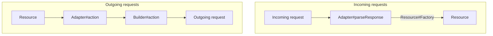

# Extendability guide

### this page is still under construction.

Some things that can be customized are:
* **The outgoing request**, which consists of two things:
	* the request itself: the `HTTP` method,  `url`, etc
	* construction of the request `body`.
*  **The incoming request**
	* parsing the JSON before feeding it to the models for instantiation.

Generally, this customization can be done:
* **Globally**: for all your models at once
* **Regionally**: as specified per model
* **Locally**: different for actions within the same model.

First, before providing us with examples, some parts of the  structure will be explained that is related to it.

## Adapters and Builders

| Callee                  | Pipeline | Outgoing request:  Adapter method involved | Outgoing request: Builder method involved | HTTP Verb used | Incoming response:  Adapter method involved |
|-------------------------|----------|--------------------------------------------|-------------------------------------------|----------------|---------------------------------------------|
| Resource class          | fetch    | none                                       | SimpleBuilder#fetch                       | GET            | SimpleAdapter#parseResponse                 |
| Resource instance       | save     | none                                       | SimpleBuilder#save                        | POST           | SimpleAdapter#parseResponse                 |
| Resource instance       | update   | SimpleAdapter#fetch                        | SimpleBuilder#update                      | PATCH          | none                                        |
| Resource instance       | delete   | none                                       | SimpleBuilder#delete                      | DELETE         | none                                        |
| ToOneRelation instance  | set      | ToOneAdapter#set                           | ToOneBuilder#set                          | PATCH          | none                                        |
| ToOneRelation instance  | remove   | ToOneAdapter#remove                        | ToOneBuilder#remove                       | DELETE         | none                                        |
| ToManyRelation instance | add      | ToManyAdapter#add                          | ToManyBuilder#add                         | PATCH          | none                                        |
| ToManyRelation instance | remove   | ToManyAdapter#remove                       | ToManyBuilder#remove                      | DELETE         | none                                        |